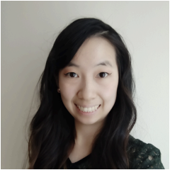
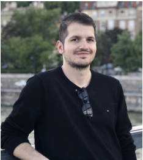
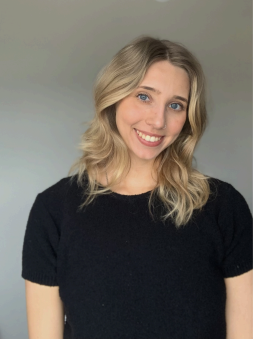

# Meet Your Faculty

#### Frances Wong

>Assistant Professor, Teaching Stream  
University of Toronto Missisauga  
>
> --- frances.wong@utoronto.ca

Frances Wong is an assistant professor, teaching stream, at the University of Toronto
Mississauga Department of Biology. She is interested in how dynamic cell populations make
decisions (sometimes incorrectly!) during development. Frances used a systems biology
approach to investigate human placenta development by isolating single cells at multiple time
points during early development to computationally assemble a cell atlas of first trimester
development. Currently, Frances incorporates computational literacy as a core course
objective in biology courses she teaches to empower over 1000 students to analyze the data
they collect each semester.

#### Andrés Melani

>Ph.D. student, Courtot Lab  
University of Toronto | Ontario Institute for Cancer Research  
Toronto, ON, Canada
>
> --- amelanidelahoz@oicr.on.ca

Andres is a Software Engineer with a MSc in Business Information Technologies, who is
currently pursuing his PhD in Medical Biophysics at the University of Toronto. Previously,
Andres was a professor and project coordinator for programming courses at Universidad de
Los Andes, Colombia. His main interests are Artificial Intelligence, software development, and
data analytics. Currently, his PhD project applies AI, specifically Natural Language
Processing, Large Language Models and Knowledge Representation and Reasoning, to
healthcare scenarios.

#### Amin Noorani

>Master Student | Bioinformatician  
Toronto Metropolitan University (Olson Lab)
Princess Margaret Genomic Centre (Epigenome Lab)  
Toronto, ON, Canada
>
> --- amin.noorani@uhn.ca

Amin is a bioinformatician at Princess Margaret Genomic Centre (PMGC) who is also
pursuing his master's degree at Olson Lab at Toronto Metropolitan University (TMU). Prior to
his current roles, he earned his bachelor's degree in Bioinformatics and started his current
position at PMGC in 2022. His expertise includes analyzing various types of data, including
epigenomics and genomics, from raw data to visualization. His master's project focuses on
exploring gene expression data in ovarian cancer cell lines, as well as image classification to
determine whether cell images have been treated with various compounds.

#### Zoe Klein

>PhD Candidate, Reimand Lab  
University of Toronto  
>
> --- z.klein@mail.utoronto.ca

Zoe Klein is a PhD candidate at the University of Toronto and the Ontario Institute for Cancer
Research. She uses large-scale data analytics and machine learning to study the role of
non-coding RNA transcripts in cancer.

#### Michelle Brazas, PhD

>Scientific Director  
Canadian Bioinformatics Workshops (CBW)  
Toronto, ON, CA
>
> --- director@bioinformatics.ca

Dr. Michelle Brazas is the Associate Director for Adaptive Oncology at the Ontario Institute for
Cancer Research (OICR), and acting Scientific Director at Bioinformatics.ca. Previously, Dr.
Brazas was the Program Manager for Bioinformatics.ca and a faculty member in
Biotechnology at BCIT. Michelle co-founded and runs the Toronto Bioinformatics User Group
(TorBUG) now in its 11th season, and plays an active role in the International Society of
Computational Biology where she sits on the Board of Directors and Executive Board.

#### Nia Hughes (she/her)

>Platform Training Manager, Canadian Bioinformatics Hub 
Ontario Institute for Cancer Research 
Toronto, ON, Canada
>
> --- training@bioinformatics.ca

Nia is the Platform Training Manager for the Canadian Bioinformatics Hub, where she coordinates the Canadian Bioinformatics Workshop Series. Prior to starting at OICR, she completed her M.Sc. in Bioinformatics from the University of Guelph in 2020 before working there as a bioinformatician studying epigenetic and transcriptomic patterns across maize varieties.

